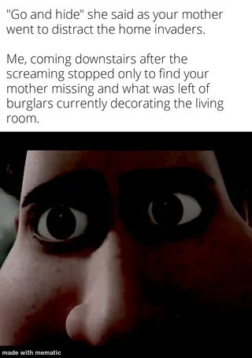

# longer than she ever was

I remember the first time I saw my reflection fracture. The way my true face pushed through the human mask I'd worn for so long, desperate to emerge. I fought it back, pressing my palms against my cheeks until they felt solid again. My son was in the next room, and I couldn't let him see – not yet, not ever.

The thing about wearing someone else's life is that you start to believe you deserve it. Fifteen years I've been his mother, longer than she ever was. I've kissed scraped knees, celebrated birthdays, weathered teenage storms. But every time I catch my reflection, every time I see those hollow eyes threatening to surface, I'm reminded that I'm living a stolen happiness.

When they broke in tonight, I knew what I had to do. "Go and hide," I told him, my voice steady despite the scratching beneath my skin. He ran upstairs – such a good boy, always listening to his mother. Even now, as my joints crack and bend in ways human bones shouldn't, as my true form emerges in the darkness of our living room, I think only of keeping him safe.

The intruders didn't expect what they found. They came looking for valuables, but they found something ancient instead. Something that had learned to love so deeply it forgot its own nature – until it needed to protect that love.

I can hear the silence now, feel the sticky warmth on my elongated fingers. Soon my son will come downstairs, looking for the mother who saved him. He'll find only evidence of violence, signs of struggle, a mystery he'll never solve. It's better this way. Better he thinks I died protecting him than know the truth: that something as twisted as me dared to love him at all.

I leave through the broken window, my true form melting into the darkness. Behind me, I leave everything I cherish – my home, my photographs, my life. Most of all, I leave my son, who will mourn a mother who never existed and, perhaps someday, thank the monster who loved him enough to disappear.

## Original prompt

I don't remember what the prompts were, but I asked Claude to write something based on these images which I found on Reddit:

## Commentary

As is probably obvious by my choice of title, the line about the monster being the boy's mother for longer than the 'real' one is a personal favourite of mine.  But there's a lot of good lines in here. 'They came looking for valuables, but they found something ancient instead.' is a contender for second-place.