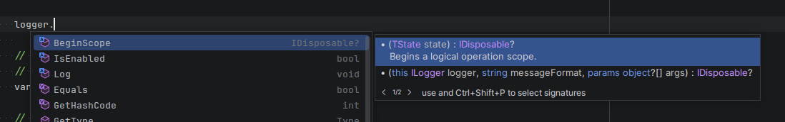
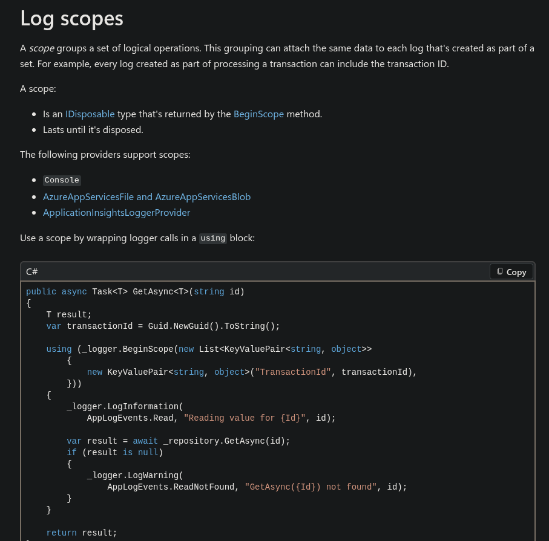

= Is ILogger<T>.BeginScope a bad API?
Jack Kendall <jkendall3096@gmail.com>
:toc:

== Introduction

If you write C# regularly, you have likely encountered the venerable `ILogger` on a regular basis. It's the Microsoft-provided and Microsoft-approved logging abstraction for everyday code. Rather than working directly against a logging implementation (like, Serilog, Seq or even `Console.WriteLine`), you inject an `ILogger<T>` and get to ignore all the tedious implementation details. Basic usage is extremely straightforward:

```csharp
// The simplest case - barebones raw-string logs.
logger.LogInformation("Hello world");

// You can emit messages at different severities.
logger.LogDebug("This is a lower-level message, useful for tracing execution flow");
logger.LogCritical("This is a serious error");

// Structured logging is supported.
// You can pass variables down and the logging implementation will
// make use of them for rich diagnostics in environments which support it (Seq, OpenTelemetry, etc.)
var user = new
{
    Username = "Jane Doe",
    Age = 23
}

logger.LogInformation("User {Username} has logged in", user.Username);
```

The API is approach and easy to understand.

...except, of course, for the ugly duckling called `BeginScope()`.

Most people are likely introduced to this method by their IDE's Intellisense. The experience is not particularly enlightening:



Documentation is meant to answer questions, but unfortunately, this only serves to raise them.

- What is a 'logical operation scope'? The phrase seems awfully abstract. How does it relate to logging?
- Why does it accept a generic `TState` argument? Isn't logging about formatting strings?
- Oh, there's another overload which does take a `messageFormat`... what's the difference?
- Wait, why does it return `IDisposable`? And why is it nullable?

== Searching for answers

Well, let's be reasonable. We can't expect a full design breakdown in a few lines of text stuffed into an IDE helpbox. Let's be proper developers and link:https://learn.microsoft.com/en-us/dotnet/core/extensions/logging[go read the documentation]. This is essentially the entire description Microsoft gives to the topic:



I have mixed feelings about this piece of documentation. It does some things objectively right.

- It begins by laying out why you would want to use the feature. Attaching a transaction ID to every log message in a method seems intuitively useful. Everybody has repeatedly included information in log statements and thought, 'I wish I didn't have to do this'.
- It immediately gives you a code example that you can copy and paste.

However, I also think it has some serious flaws.

- It doesn't show an example of the end-result of this process. What does it actually look like in my logs when I use this whole scope business? Is it worth it for me to use it?
- The language is still quite abstract. 'A set of logical operations' is not immediately intuitive for me. The language it's searching for is that the breadth of the scope is determined by your business logic and your domain, not the logging infrastructure, but this is not express clearly.
- The list of providers which support scopes is quite misleading. It gives the impression that this is some niche functionality only supported by three logging implementors, whereas in reality it's ubiqutous across the .NET ecosystem.
- Zero explanation is given for how we can pass down a collection of `KeyValuePair` objects to the method, or why we might want to do this.

The code example itself is rather messy.

- Using both `transactionId` and `id` in the same example suggests a false similarity between the two variables. The difference between the transaction-level ID and the resource-level ID is not explained.
- Silently using other features of `ILogger` muddies the waters. Do I need to use the `LogInformation` overload which takes an `EventId` to make use of scopes, or is it irrelevant?
- The example uses the verbose form of the `using` statement for no particular reason. The `using var scope = ...` syntax would have worked here, resulting in less indentation and easier-to-follow code.
- No effort is made to reduce the verbosity of the parameters passed to `BeginScope()`. The reader is subjected to seeing the somewhat unfamiliar `KeyValuePair<string, object>` twice for no good reason. Simply passing down a `Dictionary<string, object>` would be clearer and more common to real-life usage.

Ultimately, the student is left with more questions than answers.

== Looking deeper

If Microsoft will not help us, we must take control of our own lives.

When you searching `ILogger.BeginScope`, you will very quickly encounter link:https://nblumhardt.com/2016/11/ilogger-beginscope/[this blogpost] from Nicholas Blumhardt, creator of the extremely popular Serilog framework.

It's an exceptionally lucid and clear post, so instead of rehashing its content, I will encourage you to go read it. It provides an actual explanation for why you would use the method and reasoning behind its design.

The biggest takeaway from Nicholas's post, in my opinion, is that `BeginScope` is a very low-level API. It provides very little context because it's intended to be highly generic and not hinder implementers of the `ILogger` interface. Unfortunately, this lack of guardrails makes it very easy to cut yourself on its sharp edges.

The most prominent way this manifests is that the method will most likely do entirely different things depending on which arguments you give it, without any indication of what is happening. Will it attach metadata to the scope, or treat the entire scope as a singular message? Well, you 'just have to know'. It depends on what logging framework you use and what specific interfaces are implemented by the arguments you pass down.

As Nicholas says:

> Just because you can pass practically anything to BeginScope() doesn't mean that you necessarily should.

This is a stellar example of a 'pit of failure' design. It is easier to use the API wrong than it is to use it correctly.

== How could it have been better?

While it's gratifying to criticise an unclear API, the .NET team were in a very unenviable position when designing `BeginScope`. They had to provide a method which was flexible enough to accomodate wildly disparate forms of logging, did not inherently impose performance limitations, and was at least moderately ergonomic to use.

Their hands were also tied, to some degree, by the language they were working in. I've always disliked how `IDisposable` has come to be used as an ersatz form of Rust's `Drop` trait in .NET: the interface was originally meant for when we wanted deterministic cleanup of unmanaged resources, but because we don't have any other way to express 'please automatically invoke some code when this variable goes out of scope', `IDisposable` has been enlisted into many scenarios where it semantically doesn't belong. That alone accounts for some of the awkwardness with `BeginScope`.

Since it's unfair to criticise something without offering constructive suggestions for improvements, here are some of my thoughts on how the experience of working with `ILogger` scopes could have been improved.

=== Introduce a `ILoggingScope` type

The return type of `BeginScope` did not have to be a raw `IDisposable`. Semantic meaning could have been introduced by having it return some interface like this:

```csharp
public interface ILoggingScope : IDisposable;
```

A primary benefit of this is that introducing a strong type gives you another place to put documentation. Microsoft could have added some XML docs to this interface outlining what a scope meant and why it implemented `IDisposable`. New users of the API would have naturally found this.

It would also have given framework writers a chance to introduce extension methods for this type. Consider something like this:

```csharp
public static class ILoggingScopeExtensions
{
    public static ILoggingScope AddAdditionalContext(this ILoggingScope scope, IEnumerable<KeyValuePair<string, object?>> context)
    {
        // ...
    }
}

public void Example()
{
    using var scope1 = logger.BeginScope(...);
    using var scope2 = scope1.AddAdditionalContext(...);
}
```

I don't know if this particular example would work out in practice - there might be a compelling reason why scopes are readonly from the point of creation onwards. But I still feel like a bespoke type would have made the semantics of logging scopes clearer.

=== Improve the documentation

TODO

the documentation should have provided an example of what logging looks like when you are using scopes

it should have used intermediate variables and had a focus on code clarity

```csharp
public void WishUserHappyBirthday(string username, int userAge)
{
    // Without a scope, we have to explicitly pass the username into the message template.
    logger.LogInformation("Doing something for {Username}", username);

    var transactionId = Guid.NewGuid();

    // Create a collection of metadata we want to associate with all log messages in this scope.
    var context = new Dictionary<string, object?>
    {
        { "TransactionId", transactionId },
        { "Username", username }
    };

    // Create the scope.
    // The 'using' statement means the scope will automatically end when this method ends.
    using var scope = logger.BeginScope(context);

    // This log will automatically be associated with the 'TransactionId' and 'Username'
    // properties we defined above.
    // The message itself won't change.
    // But logging frameworks will have access to the metadata and can (for example)
    // let you filter or group logs by them.
    // You could search for all logs where 'username = janedoe', for instance.
    logger.LogInformation("Preparing happy birthday message");

    // Any log messages inside this service will also automatically
    // have 'TransactionId' attached, even though we aren't passing
    // it to the method explicitly.
    birthdayService.SendHappyBirthdayMessage(username, userAge);
}
```

the documentation should really explain *why we care about scopes* - that in rich logging stores, we want to be able to filter and group logs based on metadata. we want to be able to associate logs with each other in a hierarchical sense to facilitate things like distributed tracing

=== Provide higher-level wrappers

The primary issue with `BeginScope` is that it's a relatively low-level API that is in reach of normal, everyday users. It's like leaving putting powertools next to your butter-knives.

What surprises me most is that this is a problem solved quite well elsewhere within the same type. The `LogDebug`, `LogInformation` and `LogWarning` methods we use daily are actually just extension methods which provide a convenient wrapper over the low-level `Log` method:

```csharp
  void Log<TState>(
    LogLevel logLevel,
    EventId eventId,
    TState state,
    Exception? exception,
    Func<TState, Exception?, string> formatter);
```

This API is ugly for all the same reasons `BeginScope` is: it has to be highly general to avoid restricting library authors. But in normal application code, we never have to worry about this method and its warts, because we have nice, friendly alternatives at our fingertips.

Why was the same not done for `BeginScope`? I feel like extension methods could have been provided which made the different use-cases of the method explicit.

```csharp
public static class ILoggerExtensions
{
    // Create a scope that attaches named key-value metadata to every log message created within the scope.
    public static ILoggingScope CreateScopeWithProperties(this ILogger, Dictionary<string, object?> properties);

    // You could imagine a CreateScopeWithProperties overload which takes an IEnumerable<KeyValuePair<...> for performance/generality.

    // Create a scope that associates a formatted string to every log message created within the scope.
    public static ILoggingScope CreateScopeWithMessage(this ILogger, string format, object?[] args);
}
```

These extensions would both just call the underlying `BeginScope`. But they would have differentiated the different semantic uses of that low-level API through their naming and the language's type-system. You no longer have to 'just know' that to attach metadata to a scope, you need to pass down some `IEnumerable` of key-value pairs; the method signature enforces it.

== Conclusion
