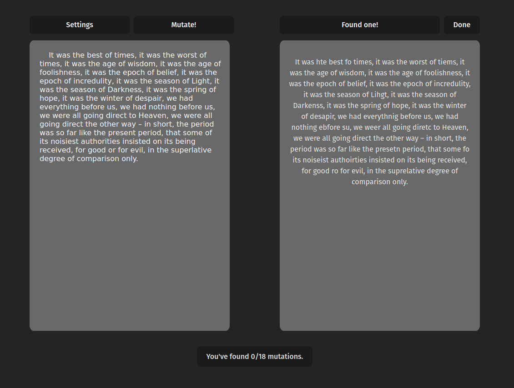

= Making Text Mutator
Jack Kendall <jkendall3096@gmail.com>
:toc:

In early 2025, I found myself having to use up a week's worth of annual leave from work. Not having anything better to do, I dedicated the time to a personal learning project. But what on? Well, I'd recently picked up Blazor for a work project and found it made web development surprisingly accessible. I was curious how that experience translated to more conventional frontend frameworks, and as such, I decided to _make a React app_. But that alone felt too small in scope, so I set myself a challenge:

- The project would follow the classic frontend-calling-a-backend-API structure.
- The backend would also be in a language slightly outside of my comfort zone -- namely, Rust.
- It would be deployed to the cloud as a real production app, preferably with a high degree of automation.
- I would not use AI for writing the code.

I have no qualms about using AI for code in normal life. In fact I find it very useful for quick prototyping. But I find that there is a certain quality of learning for me that comes only from doing things myself: typing in the characters one after another, fixing the build errors, going through the write-test-debug cycle. This did not preclude me from using AI entirely, and I used it plenty for information purposes, such as explaining a particular concept in Bicep or what setting up automated tests for a React app looked like. This sped up my learning significantly, compared to the old ways of trawling documentation and StackOverflow (though I ended up doing plenty of that as well).

I'll present the experience of making the app in rough chronological form. But first I should outline where my skills were at the outset, to put into perspective what was before me.

As mentioned before, I'd been working with Blazor for a month or two prior to this, which gave me a good introduction to writing web apps more generally. As the project progressed, I was surprised by how many of the concepts had strong parallels to React; presumably this is because Blazor was naturally influenced by it. I knew the basic shape of what writing JavaScript/TypeScript looked like, but I was basically clueless when it came to the frontend environment. To me it seemed like an amorphous mass of nouns that signified very little to outsiders -- Next.js, Vite, Nuxt, Astro...

What about Rust? Well, I knew a lot about the language __in the abstract__. I read a lot of blogs and essays aout Rust, partly because the language is very interesting, and partly because the people who like it tend to be good writers. So I understand the concepts of the language very well, including infamous bugbears like lifetimes, exclusive/shared references and so on. But I'd never really written any code in it myself, asides from a few console apps I abandoned after an hour or so. This project represented taking my assorted knowledge and putting it to practical use.

In terms of infrastructure, we had been working on a migration to Azure from on-prem servers at my workplace at the time. As such I was reading up a lot on cloud fundamentals, so, again, I wasn't coming into this completely blind.

== Day 1: design

The first question was what app, exactly, I was going to build. I knew I wanted it to be a 'real' app, something that could theoretically be of use to someone, not just existing purely for the sake of showing off I could 'do frontend'. As it happened, I had an MVP project lying around in Rust from a few weeks prior that seemed like a good fit.

The core idea was that when I'm proofreading a piece of text, I want to be hyperattentive to the small details. Every period, every word, every space. But as every writer knows, you quickly become far too familiar with a work to look on it with a dispassionate eye; you read what your mind thinks is there, not what the ink actually says. There are a lot of strategies for dealing with this. The most famous is to read it aloud, since that different modality gives you a different perspective on the form of the text. But I wanted to try something different: to forcibly defamiliarise the text by subtly messing it up, swapping characters around, substituting homophones for each other, that kind of thing.

Since this wasn't a serious idea at the time, I'd just gotten an AI to spit out the core logic for doing this. I tried it out a few times, saw it basically worked, and my intellectual curiosity was mostly satisfied. As such I put it away until I was searching around for something to turn into a Real App, and, as mentioned, it seemed like a natural fit.

Before starting the project proper, I decided to take things seriously and hammer out a design spec to guide my work. I've done this a few times and always found it useful. Decision-making is the hardest part of programming, and frontloading it often saves a significant amount of time down the line.

Because I don't care about their literary qualities, my preferred method for writing specs is to use AI. Specifically, I enter a back-and-forth Q/A session with a fast, cheap model (GPT 4o), where the model teases out specific details about my plans. After twenty minutes, I had a pretty decent starting point, but it was pretty thin on the bones. I took 4o's spec and then fed it through Gemini 2.5, which as of writing is the state-of-the-art. It gave me _significantly_ more challenging and detailed questions to puzzle through, but by the end of it, I had a very detailed spec which I could begin translating into reality.

If you are interested, you can read the full spec link:https://github.com/jkendall327/text-mutator/blob/master/docs/SPEC.md[here].

Because this was going to be a user-facing application, I also thought it pertinent to spend a little time thinking about visuals and layout. I'm not a designer (though it's something I'm interested in, clearly), so my intuition was to head over to link:https://excalidraw.com/[Excalidraw] and just start sketching.

I knew the core of the app would revolve around seeing two passages of text side-by-side: the original plaintext and the mutated text. That naturally suggested a columnar layout. My user actions mapped sensibly onto buttons, and without an overriding reason to put them anywhere else, I attached them to the most relevant text column.

image:https://raw.githubusercontent.com/jkendall327/text-mutator/refs/heads/master/docs/design.png[]

This design was very useful when I finally got around to making the frontend. I didn't adhere to it with 100% strictness (for example, I added the 'settings' button), but the problem of translating that image to CSS was far easier than the problem I've had in the past, which was translating a formless idea in my head to CSS.

== Day 1: Rust

With the design done, it was time to start actually writing code.

I started with the backend for two reasons. Firstly, I felt more comfortable jumping into Rust, and didn't want to get discouraged off the bat with the more difficult topics. Secondly, I already had the MVP text mutator code written for me by AI. I felt no particular reason to rewrite that business logic myself, since it worked well enough and thinking through the algorithm for mutating text wasn't the real point of this project.

But I did have to think through how to convert it to a REST API, since it was previously a simple CLI app. I knew some of the big names in the Rust web framework game, but had no particular reason to pick one over the other. As such I went back to Gemini and asked it to give me a broad overview of the ecosystem. I did this later, as well, when figuring out my choices for frontend libraries; it was very useful for seeing which options were the 'safe bet', which were more experimental, which were becoming outdated and so on.

Gemini indicated that axum was the safe bet for a Rust API, and seeing no reason to cut myself on the bleeding edge, that's what I chose. I spent a half-hour or so reading the axum docs and found that transforming my project into an API was surprisingly easy. The setup was almost entirely done in `main.rs`, and I could steal their boilerplate example code for all the additional features I wanted to add, such as CORS, tracing and fallback routing.

My experience with .NET was of course highly relevant here. I already knew a lot of the principles behind making a 'good API', such as clear distinctions between DTO and domain models, putting in versioning from the start, graceful shutdowns and so on. There were no real conceptual challenges here: I was just learning new syntax and axum's particular mechanism for hooking up HTTP verbs to Rust functions. In general, axum was impressively easy to work with. I was completely insulated from the complex borrow-checker issues you might expect in an exploratory Rust project, and could essentially plug my existing code into a handler method. This was presumably helped by my app's simple requirements -- no auth, no persistence, no nothin' except pure business logic. But I suspect adding those features would only represent a linear amount of added labour.

On a personal level, working with Rust was highly enjoyable. I've always thought of it as the 'do it right' language, and it really did give me the feeling that I knew exactly what was going on at every point. (Not so with the other parts of this project!)

By the end of day one, I had the API essentially complete. I added a small HTTP file in lieu of proper E2E tests and spent a little time setting up the basic boilerplate code for the frontend. AI pointed me towards using Vite as my React framework, since that was apparently the fast and modern solution.

== Day 2: infrastructure

I dedicated this entire day to setting up the infrastructure and automation side of the project. In the past, I've been burned by leaving it too late and becoming discouraged by the attendant complexity of actually getting something out in front of the world, so I deliberately prioritised it for this project.

Azure was my cloud of choice, purely because I was already semi-familiar with its offerings, and I figured that getting more familiar with it would also help me at work. I have zero love for manually clicking through web interfaces, so from the outset I started a Bicep file, as well as a CI pipeline for GitHub. (Bicep is Microsoft's Azure-specific infrastructure-as-code product.)

My plans for the infrastructure changed significantly over the course of the day, as I learned more about Azure's offerings and their relative benefits and limitations. My initial idea was to simply start up an App Service Plan with two child App Services -- one for the frontend, one for the backend. The frontend would call the backend via an environment variable, and all would be well. There was a little confusion early on if I would need Azure's 'API Management' service, but that turned out to be extremely overkill for what I needed.

The first issue was that App Services didn't support running Rust natively. That meant I needed to introduce containerisation to the project's vocabulary. No big deal there; I'm comfortable with containers. But in turn I had to introduce Azure Container Registry as a place to store the image for the backend, and set my App Service to pull from it. That complexity represented a lot of time and frustration.

Additionally, I learned that Azure has a product offering specifically for static HTML/CSS/JS websites, appropriately named Azure Static Web Apps. These are incredibly cheap, almost free, so naturally I wanted to exploit that. They handily came with another feature called 'linked backends', which automagically handled funneling requests from the frontend to the backend. While useful, this feature gave me a lot of difficulty when trying to set it up in Bicep. Its implementation there seems somewhat half-baked; while it worked initially, it failed on subsequent runs, as static web apps can only have one linked backend. Maybe there is some Bicep magic that makes this operation properly idempotent, but I found some GitHub issues indicating it was actually just a bug. So I had to settle for setting up the linked backend manually, which was unfortunate.

The main stumbling-block with the infrastructure for this project was that I had no clear mental model for what a Bicep solution 'should' look like.

My naive intuition was that it should create _everything_ for a project: spin up the resource group de novo, the managed identities, the role permissions, everything. While all of that is technically possible, I quickly got the impression it was the wrong route to go down. Wanting to create resource groups in Azure seems to require very high-level permissions: Contributor should theoretically be enough, but failed for me, so I had to set up my managed agent which executed the deployment as a subscription-level Owner. That obviously rang alarm bells, so I scaled down my plans. I settled for creating the resource group manually and using automation just to ensure that everything within that RG was set up properly.

This is an area where I still need to do plenty of research on what serious solutions look like.

The actual processing of writing Bicep files was surprisingly painless -- it's a pretty good syntax, though the documentation for the various AVM 'modules' you're meant to use as a best practice was lacking. Unsurprisingly, hooking everything together in CI was frustrating and tedious. It took me around fifty failed runs to get something that worked, which is not bad for CI. By the end of the day I had a rather fragile solution, but one I was happy with, especially since I had not taken the 'easy way' out on authorisation, and gone for the full shebang of link:https://learn.microsoft.com/en-us/entra/workload-id/workload-identity-federation-create-trust-user-assigned-managed-identity?pivots=identity-wif-mi-methods-azp[managed identities with federated credentials].

== Day 3: frontend

== Day 4: cleanup

- realising I could shrink the backend image significantly
- fixing the image config set thing for the backend app service