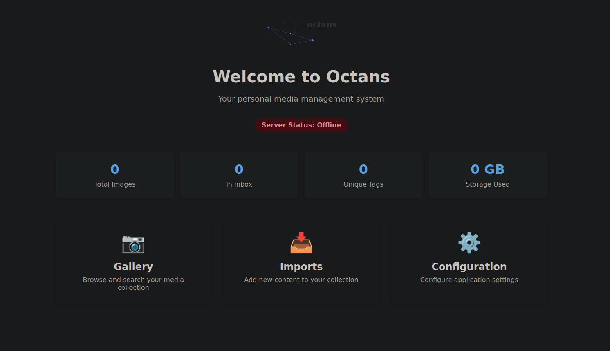
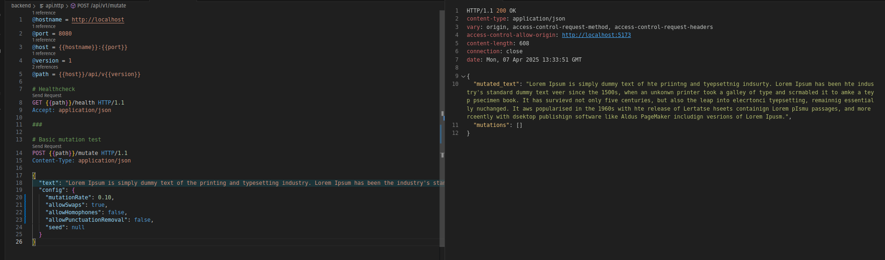
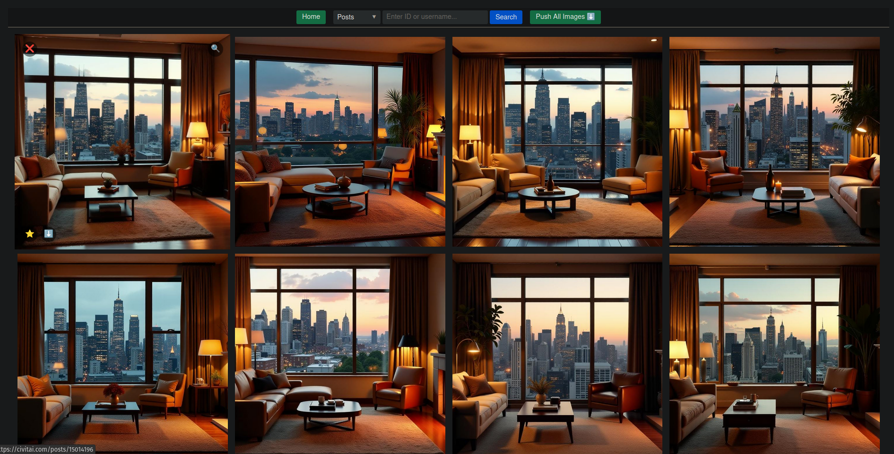
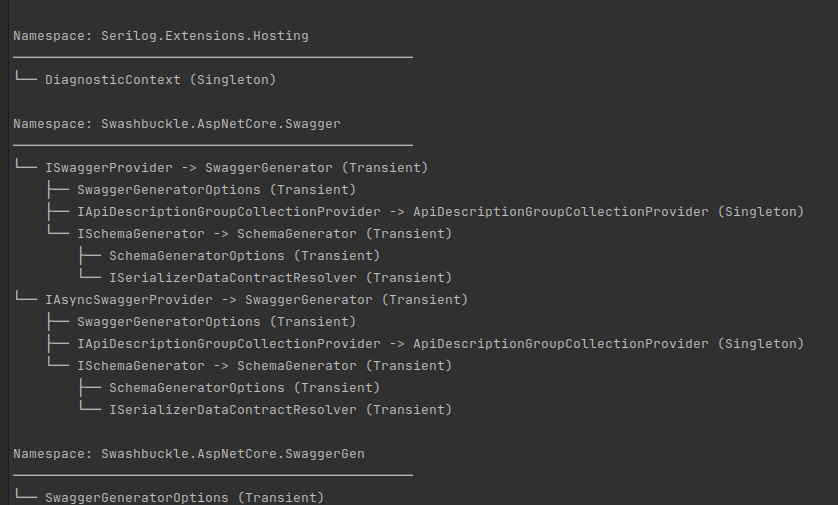
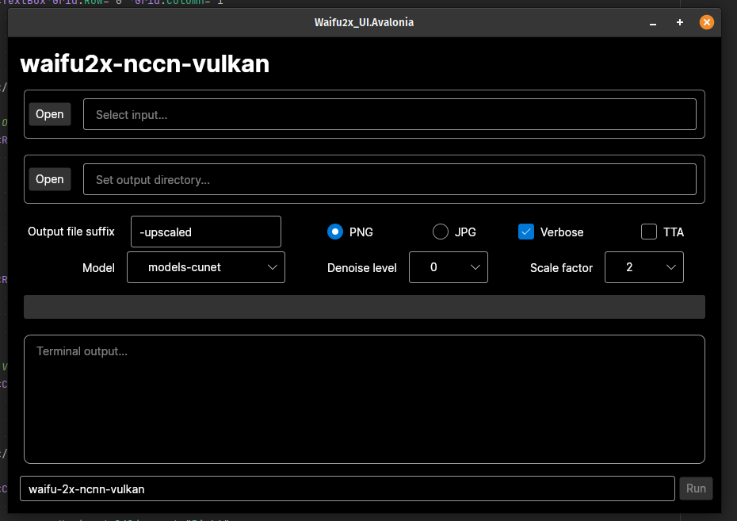
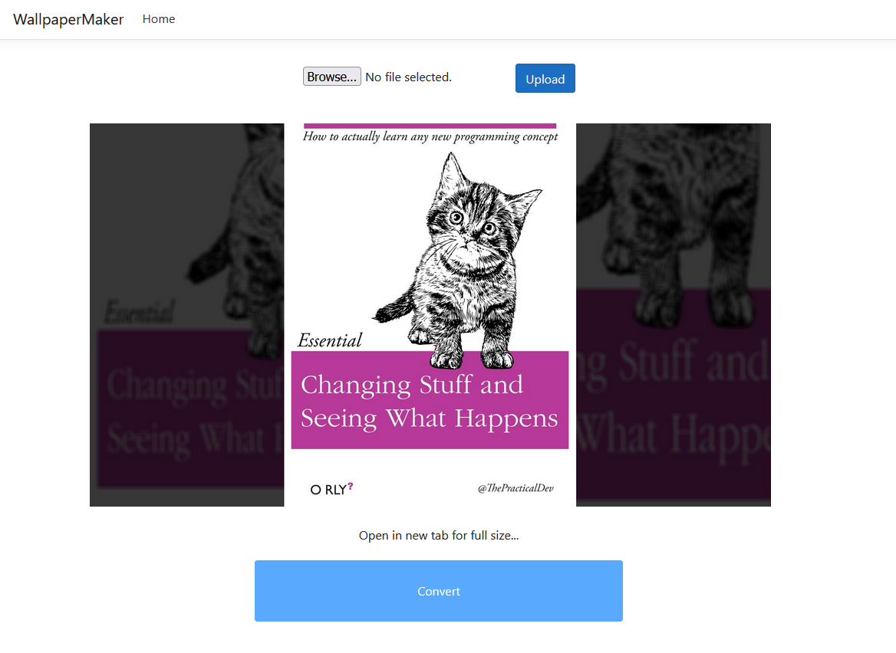
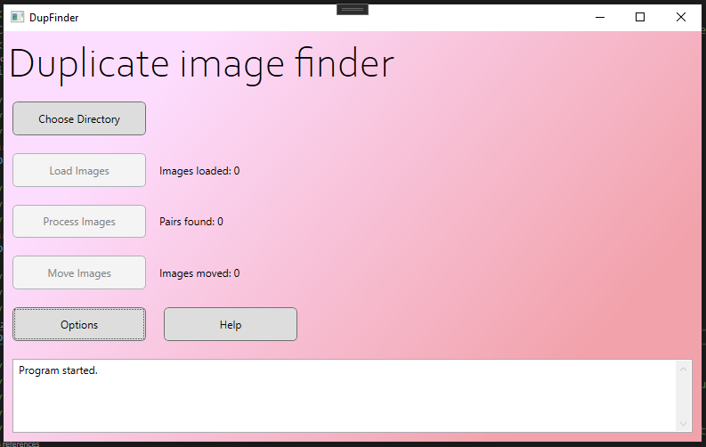

= Programming projects
Jack Kendall <jkendall3096@gmail.com>
:toc:

This page lists the various programming projects I've worked on in my free time, in rough chronological order. I find that writing little summaries forces me to put them into context which wasn't always clear when I was making them: why I started the project in the first place, why I made the choices I did, why it either did or didn't work out. Like an old diary, reading the retrospectives for projects I did when I was just starting out as a programmer help me remember that I'm not always as stagnant or directionless as I sometimes feel.

== Octans - 2025

This is a WIP image management system heavily inspired by https://hydrusnetwork.github.io/hydrus/index.html:[the Hydrus Network]. While I love that app, I find it rather slow and clunky. I decided to recreate it as a deliberately extravagant goal - a Serious App I could cut my teeth on architecturally. It has been a fun ride so far. As time goes on, I question the client/server split I made (both do server-style work, the distinction is between the 'core' database activities and everything else).

One thing I'm proud of is the levels of code quality I've kept to here. I have ratcheted up the static analysis as far as I can, got formatting verified in CI, full integration tests, the whole works. Unsurprisingly, it makes it far easier to actually get things done without breaking stuff!

== Text Mutator - 2025

This app is a learning project moreso than an actual tool, though my hope is it'll be useful once complete. The elevator pitch is that it weaponises defamiliarisation for the purpose of editing. That is, it deliberately introduces small errors into a passage of text, such that you are forced when reviewing it to be hyper-attentive on the word and character level. This breaks the spell every writer knows, where typos are entirely invisible until the moment you hit 'publish'.

I said this was a learning project. I went into it with a clear plan in mind; I would use it to take frontend development seriously, by which I mean using something other than Blazor, which I am quite familiar with. To keep things interesting, I would also do the backend in Rust, and deploy everything to Azure. Those latter points were not entirely new ground (I had used both in the past), but this was a good real-world use-case for putting my skills into practice.

I've naturally learned a lot in doing this, even though it's nowhere near complete as of yet. (For instance, the frontend UI is only starting to take shape). For instance, I've gotten to a good place of understanding with Bicep, the Microsoft-blessed infrastructure-as-code solution for Azure, such that I'd feel comfortable using it for production concerns.

Amusingly, the Rust backend has been the easiest part so far, and by a wide margin. Says something about the state of the cloud and frontend development.

== Civitai Firehose - 2024

After we got into using Blazor at work, I became enthralled at how easy it made making real web apps; not having to deal with the nightmarish JS frontend ecosystem was a real boon. As such I started up this app as a side project.

The motivation was enjoying the endless stream of cool AI images on Civitai, and wanting a live view that let me quickly save and organise them. This involved a lot of playing around with Civitai's API, including some of its annoying edge-cases (like JSON properties which change shape for seemingly arbitrary reasons!).

The code quality here is only mediocre, but it was fun to quickly develop a web app that actually served a practical use to me.

== DependencyInjection.Visualizer - 2024

https://github.com/jkendall327/DependencyInjection.Visualization[This project] was inspired by https://learn.microsoft.com/en-us/dotnet/api/microsoft.extensions.configuration.configurationrootextensions.getdebugview?view=net-9.0-pp:[the `IConfiguration` type's 'GetDebugView()'] method, which provides a pretty-print view of all the configuration values composed together in your .NET app. Despite dependency injection being equally important in the .NET ecosystem, there is no equivalent for the `IServiceCollection` type.

As such, I made one as a weekend project. I have found, in retrospect, that I never remember to use it when it would be useful (many such cases). It was still one of my first times making a polished NuGet package, which I found enjoyable. This was also one of the first times I really let AI take the reins and do the grunt-work of writing code, whereas I sat back in a directorial mode.

Although it's a relatively simple library, there are some interesting quirks in how C# handles generic types that I had to puzzle over, especially the always-interesting 'open generic' types.

== 2023

I was mainly focused on work and fiction for most of 2023, so my programming projects during this period amounted to a few failed attempts at rougelikes in Rust which never got far enough along to be worth making public.

== waifu-2x-nccn-vulkan-gui - 2022

Back in the ancient days of 2022, using AI for image upscaling still felt like a new and important development in computer science; nowadays it doesn't even count as a party trick.
One of the big names back then was waifu2x (sigh), but the implementation I used was CLI-only and didn't support batch-processing. I took it on myself to remedy that with a GUI, specifically one that would work on Linux, since I had moved over from Windows permanently a few months prior.

This was my attempt to use Avalonia in earnest, which is the modern, cross-platform desktop UI descended from Microsoft's WPF. It's a pretty pleasing platform to work with, though the iron law of frameworks applied: hard things were impressively easy, easy things were unfortunately hard.

There is essentially no reason to look at this app nowadays, since anyone and their pet dog can do AI upscaling with some free web service, but it was fun at the time.

== QuietTime - 2021

image:https://raw.githubusercontent.com/jkendall327/QuietTime/main/docs/main_window_screenshot.png[]

I https://github.com/jkendall327/QuietTime[describe this project on GitHub] as 'f.lux for your ears'. It's a WPF app that automatically caps your computer's volume. I made it for two reasons:

* Preventing long-term hearing damage, which I was worried about
* Stopping my new bluetooth headphones from maxing out my volume randomly

QuietTime was my first attempting making an app with 'all the bells and whistles' -- logging and DI from day one, clean architecture, keyboard shortcuts, a responsive UI, formal releases, etc. My hope is that someone else out there in the world might actually find it useful, so I held myself to a high standard of quality.

I'd like to improve it further with unit testing, localisation and UI theming, but it's currently feature-complete.

== WallpaperMaker - 2021

This app https://github.com/jkendall327/WallpaperMaker:[converts an image of arbitrary size into a 1920x1080 jpg] suitable for a desktop wallpaper.

It currently fills out the side panels by taking a random snapshot of the main image. I might change this in future.

My big weakness is web stuff, so I made this ASP.NET Core webapp as a learning experience.

Pages are served with Razor, image conversion through a backend API in the same project.

Frighteningly, it also includes a little JavaScript.

This is in active development. My plan is to try making a proper UI in one of the big three JS frameworks (probably Angular).

== dotnet explanations

OK, this technically isn't a programming project.

Over the past few months I've created https://github.com/jkendall327/dotnet-explanations:[a simple static site with clear, plain-English explanations] of tricky .NET and C# concepts.

Almost all tutorials I've found online focus too rigidly on the mechanics of programming rather than making appeals to intuition. 

To counter that, I try to always foreground what problem a particular language feature or technology is meant to solve, and avoid jargon.

== UK Tax Calculator - 2021

image:https://raw.githubusercontent.com/jkendall327/UK-Tax-Calculator/master/TaxCrud/Image.png[]

Since I left my retail job I've been link:writing-portfolio.html[working as a freelance copywriter]. 

I recently filed for my first self-employed tax return, which inspired me to make an app that would help the process along.

The result was https://github.com/jkendall327/UK-Tax-Calculator:[a simple CRUD app that stored transactions, calculated their total and your outstanding tax]. 

The tax calculation was very simple and not suitable for real use, but I'm quite happy with the UI, which is a combination of two NuGet packages.

This was my first project working seriously with databases (I used SQLite), which was very instructive.

== DupFinder - 2021

I have a lot of holiday photos taking up space on my PC, so I'm always searching for a good heuristic near-duplicate finder for images. 

I'm not satisfied with any currently existing solution, so https://github.com/jkendall327/DupFinder:[I made my my own].

I made this before I got really comfortable with WPF, so the UI isn't spectacular, but it does showcase some async work and interesting ways of comparing image data.