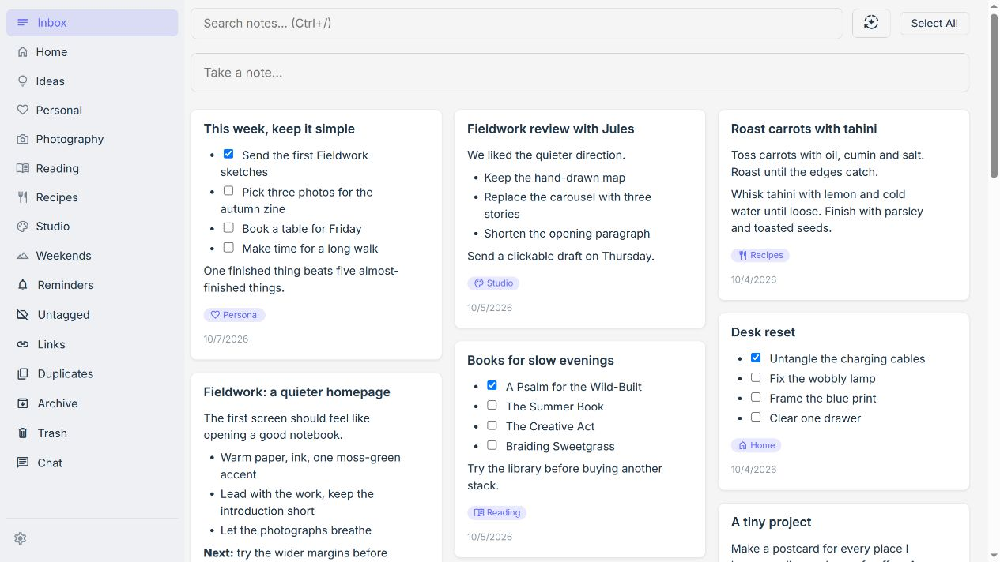
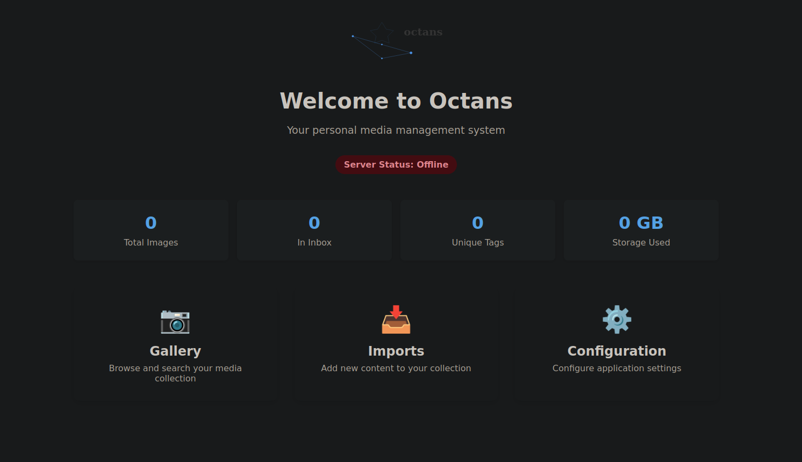
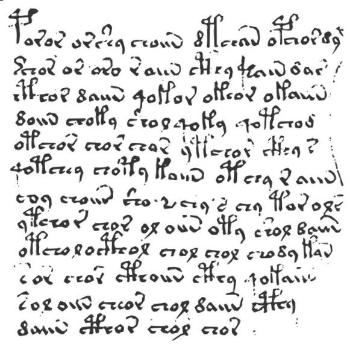
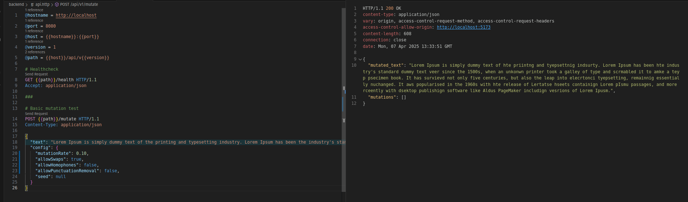
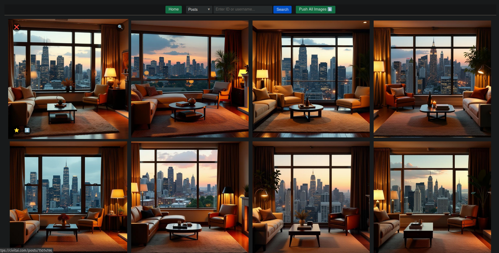
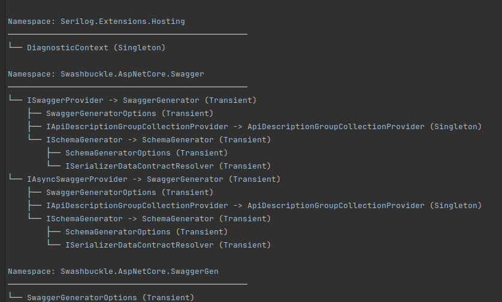
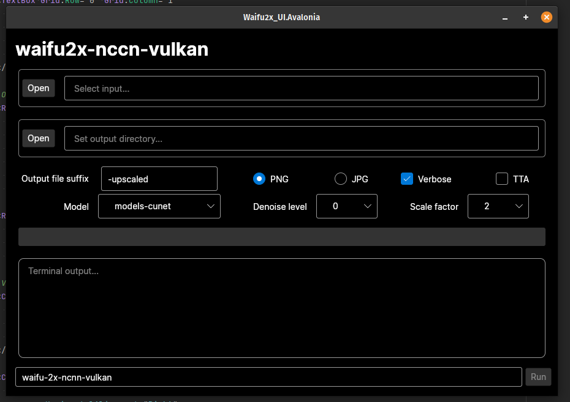
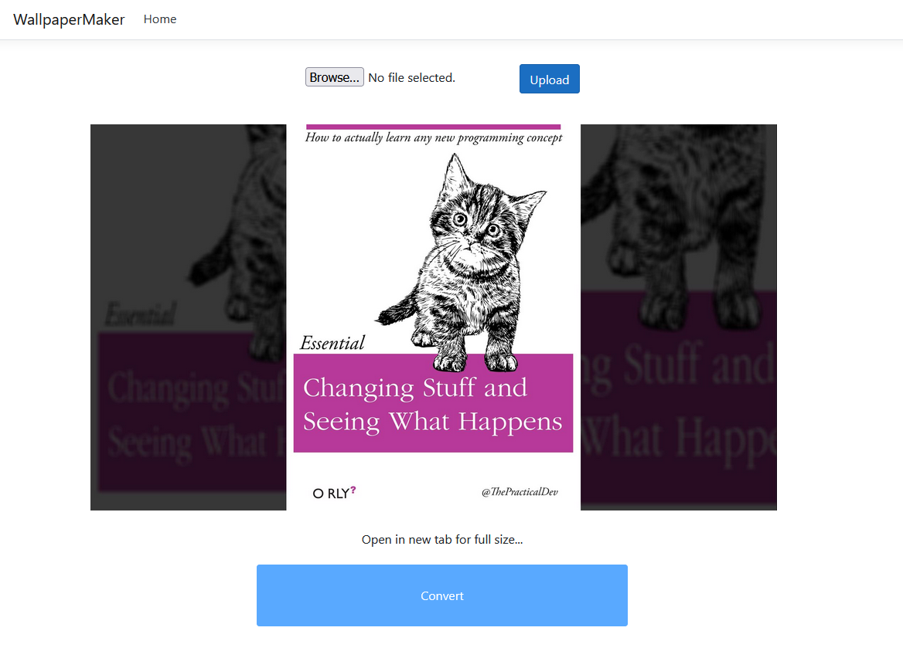
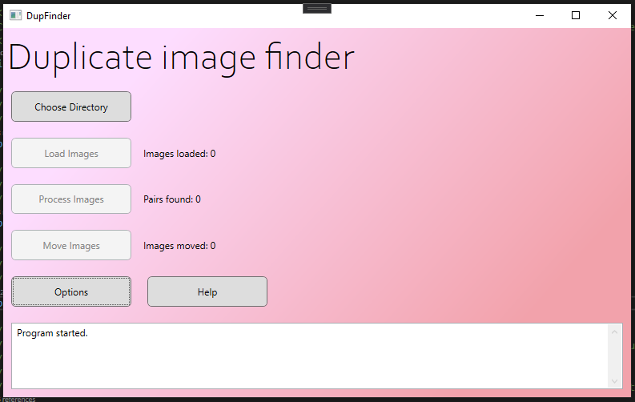

This page lists the various programming projects I've worked on in my free time, in rough chronological order. I find that writing little summaries forces me to put them into context which wasn't always clear when I was making them: why I started the project in the first place, why I made the choices I did, why it either did or didn't work out. Like an old diary, reading the retrospectives for projects I did when I was just starting out as a programmer help me remember the progress I've made over my career so far.

## Keeper - 2026

[GitHub](https://github.com/jkendall327/keeper)

Full-featured replacement of Google Keep. TypeScript.

I use Keep a lot, but because Google has a vested interest in maintaining a walled garden, they make it tedious to export your stuff from it.
This app was the result of my 'there has to be a better way' impulse.
All the other options were too bloated for what I wanted, which was really a digital inbox/staging ground moreso than a note-taking app.

This was, I think, my first entirely vibecoded project, probably done with one of the early post-GPT 5 models in Codex.
I was still fairly low-down in the code and architecture, which meant a lot of churn when I wasn't satisfied with the agent's early choices.

I use this thing on a daily basis and it's been a great advertisement for building your own tools.
Getting to scrub away all the minor frustrations I had with Google Keep was deeply satisfying.

One day I might make this into a real web app with a domain and users.

## Octans - 2024 - 2026

[GitHub](https://github.com/jkendall327/octans)

This is a WIP image management system heavily inspired by [the Hydrus Network](https://hydrusnetwork.github.io/hydrus/index.html). While I love that app, I find it rather slow and clunky. I decided to recreate it as a deliberately extravagant goal - a Serious App I could cut my teeth on architecturally. It has been a fun ride so far. As time goes on, I question the client/server split I made (both do server-style work, the distinction is between the 'core' database activities and everything else).

One thing I'm proud of is the levels of code quality I've kept to here. I have ratcheted up the static analysis as far as I can, got formatting verified in CI, full integration tests, the whole works. Unsurprisingly, it makes it far easier to actually get things done without breaking stuff!

## voynich-lgp - 2025

[GitHub](https://github.com/jkendall327/voynich-lgp)

Linear genetic programming solution for identifying potential cryptographic composition methods of the [Voynich Manuscript](https://en.wikipedia.org/wiki/Voynich_manuscript). Rust.

This was one of my first projects where I went really hard on AI.
The original C# codebase was, to my memory, mostly me, and a very fun learning experience into the realm of genetic programming.
That wasn't performant enough, so I worked with whatever Opus model was prevalent at the time to boil the app down into a massive specification.
I then had it build it all up again in Rust, which delivered massive perf wins and made me really fall in love with the language.

GP is the sibling of machine learning that never really got the limelight, because it scales poorly.
But it was a good fit for this domain, where I had concepts mapping very neatly onto the notion of genomes.

This project never really bore academic fruit because I couldn't get clean enough statistics for it to be really useful.

## Scribal - 2025

[GitHub](https://github.com/jkendall327/scribal)

Agentic harness in the style of Aider (remember that?) tuned for writing and editing fiction.
Made completely obsolete by the Claude Code revolution immediately after.

I've written other harness-style things before and after, but this is the first project where I started from a `while` loop.
It was a fun experience to pull back the curtain and see how a token-predictor becomes an agent.

## Text Mutator - 2025

This app was a learning project moreso than an actual tool. The elevator pitch was a defamiliarisation tool for the purpose of editing. That is, it deliberately introduced small errors into a passage of text, such that you were forced when reviewing it to be hyper-attentive on the word and character level.

I went into it with a clear plan in mind; I would use it to take frontend development seriously, by which I mean using something other than Blazor, which I am quite familiar with. To keep things interesting, I would also do the backend in Rust, and deploy everything to Azure. Those latter points were not entirely new ground (I had used both in the past), but this was a good real-world use-case for putting my skills into practice.

The Rust backend was the easiest part, and by a wide margin. Says something about the state of the cloud.

## Civitai Firehose - 2024

After we got into using Blazor at work, I became enthralled at how easy it made making real web apps; not having to deal with the nightmarish JS frontend ecosystem was a real boon. As such I started up this app as a side project.

The motivation was enjoying the endless stream of cool AI images on Civitai, and wanting a live view that let me quickly save and organise them. This involved a lot of playing around with Civitai's API, including some of its annoying edge-cases (like JSON properties which change shape for seemingly arbitrary reasons!).

The code quality here is only mediocre, but it was fun to quickly develop a web app that actually served a practical use to me.

## DependencyInjection.Visualizer - 2024

[This project](https://github.com/jkendall327/DependencyInjection.Visualization) was inspired by [the `IConfiguration` type's 'GetDebugView()'](https://learn.microsoft.com/en-us/dotnet/api/microsoft.extensions.configuration.configurationrootextensions.getdebugview?view=net-9.0-pp) method, which provides a pretty-print view of all the configuration values composed together in your .NET app. Despite dependency injection being equally important in the .NET ecosystem, there is no equivalent for the `IServiceCollection` type.

As such, I made one as a weekend project. I have found, in retrospect, that I never remember to use it when it would be useful (many such cases). It was still one of my first times making a polished NuGet package, which I found enjoyable. This was also one of the first times I really let AI take the reins and do the grunt-work of writing code, whereas I sat back in a directorial mode.

Although it's a relatively simple library, there are some interesting quirks in how C# handles generic types that I had to puzzle over, especially the always-interesting 'open generic' types.

## 2023

I was mainly focused on work and fiction for most of 2023, so my programming projects during this period amounted to a few failed attempts at rougelikes in Rust which never got far enough along to be worth making public.

## waifu-2x-nccn-vulkan-gui - 2022

In 2022, using AI for image upscaling still felt like a new and important development in computer science. One of the big names back then was waifu2x (sigh), but the implementation I used was CLI-only and didn't support batch-processing. I took it on myself to remedy that with a GUI, specifically one that would work on Linux, since I had moved over from Windows permanently a few months prior.

This was my first attempt to use Avalonia in earnest. It's the modern, cross-platform desktop UI descended from Microsoft's WPF. It's a pretty pleasing platform to work with, though the iron law of frameworks applied: hard things were easy, easy things were hard.

There is essentially no reason to look at this app nowadays, since anyone and their dog can do AI upscaling with some free web service.
But it was fun at the time.

## QuietTime - 2021

I [describe this project on GitHub](https://github.com/jkendall327/QuietTime) as 'f.lux for your ears'. 
It's a WPF app that automatically caps your computer's volume. 
I made it for two reasons:

- Preventing long-term hearing damage, which I was bizarrely worried about at the time
- Stopping my then-new bluetooth headphones from maxing out my volume randomly

QuietTime was my first attempting making an app with 'all the bells and whistles'.
That is, logging and DI from day one, clean architecture, keyboard shortcuts, a responsive UI, formal releases, etc. 
I'd hoped someone else out there in the world might actually find it useful, so I held myself to a high standard of quality.

## WallpaperMaker - 2021

This app [converts an image of arbitrary size into a 1920x1080 jpg](https://github.com/jkendall327/WallpaperMaker) suitable for a desktop wallpaper.

Simple learning app for web stuff.

## dotnet explanations

[A simple static site with some didactic material](https://github.com/jkendall327/dotnet-explanations) I wrote for tricky .NET and C# concepts.

I was annoyed by how almost all tutorials I found online focused too rigidly on the mechanics of programming rather than making appeals to intuition.

To counter that, I wanted to make something that foregrounded what problems a particular language feature or technology was meant to solve.

## UK Tax Calculator - 2021

[A simple CRUD app that stored transactions, calculated their total and your outstanding tax](https://github.com/jkendall327/UK-Tax-Calculator).

Learning project for figuring out what these databases I'd heard so much about were good for.

I was doing freelance work at the time, hence the interest in taxes; in England you don't file anything manually in normal employment.

## DupFinder - 2021

[Old duplicate image-finder app](https://github.com/jkendall327/DupFinder).

A relic of the pre-AI age. Uses some heuristics I forgot the name of which didn't work.